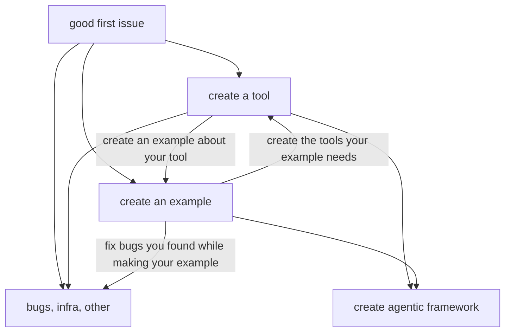

# Contributing

### Good First Issues
[`good first issue`](https://github.com/The-AI-Alliance/gofannon/issues?q=is%3Aissue%20state%3Aopen%20label%3A%22good%20first%20issue%22)s 
are intentionally very simple tasks, often involving fixing spelling typos, 
updating documentation, or making other minor changes. These issues are 
specifically designed to help newcomers become familiar with the project's 
contribution workflow - from forking the repository to submitting a pull request
and going through the review process. They require minimal technical knowledge 
while providing a complete end-to-end experience of contributing to the project.

We encourage new contributors to start with one or two Good First Issues to get 
comfortable with our workflow (but advanced users can skip if they are 
comfortable using GitHub). Once you've successfully completed a couple of these 
and feel confident navigating the commit/PR/review process, we recommend moving 
on to more substantive contributions (such as a new tool, a bug, or an infra 
task) as outlined in our contribution flow chart. This progression helps you 
build confidence while gradually tackling more complex issues that have greater 
impact on the project.

We maintain some documents to help you in this step [here](https://the-ai-alliance.github.io/gofannon/developers/first_contribution.html).

## New Tool
We have a curated guide on how to contribute a tool, you can find it hosted
[here](https://the-ai-alliance.github.io/gofannon/developers/contribute_tool.html).

## New Framework
We also have a curated guide on how to contribute a new agentic framework, you 
can find it hosted [here](https://the-ai-alliance.github.io/gofannon/developers/contribute_agentic_framework.html).

## New Examples
New examples are a great way to come up with ideas for new tools, frameworks, or
improvements to existing tools. This is why we have a new example as a possible
second step on your contribution journey. 

We do not currently have a curated guide for creating new examples, however there
is an open issue to create one [here](https://github.com/The-AI-Alliance/gofannon/issues/229)
which might have some helpful pointers. 

Mainly note that we use Google Colab as the defacto runtime for our examples 
because it removes issues revolving around different people's local environments.

## Bugs, Infra improvements, other
This would be 'other' types of issues. The nature of which precludes being able 
to write a general guide. This is more of the traditional types of issues any repo
face. They're not the exciting cool issues; they are what keeps the lights on, 
and we appreciate your help.

## Flow Chart

This is an example- you're a volunteer you can do whatever you want in any order
you want, but this guide may help. 

## PR Requirements

- Code changes require:
    - Passing unit tests
    - Code review approval
    - Updated documentation if API changes (or for additions)

- Documentation changes require:
    - Successful site build
    - No code review required (but still appreciated)

- Mixed changes must satisfy all relevant requirements  
