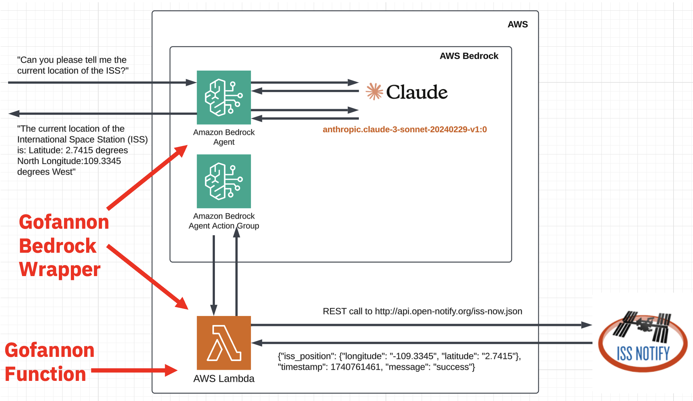
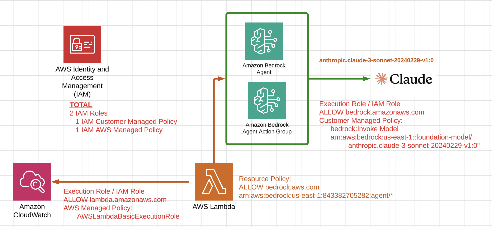
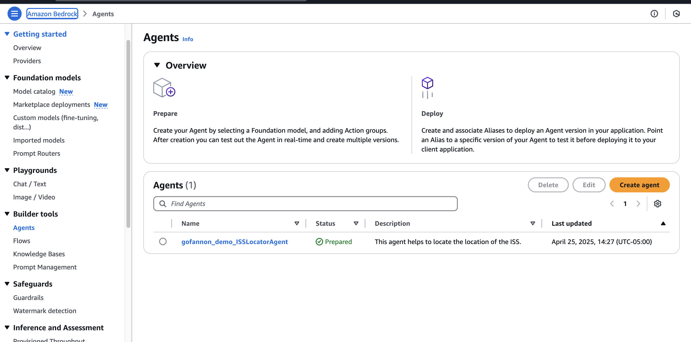
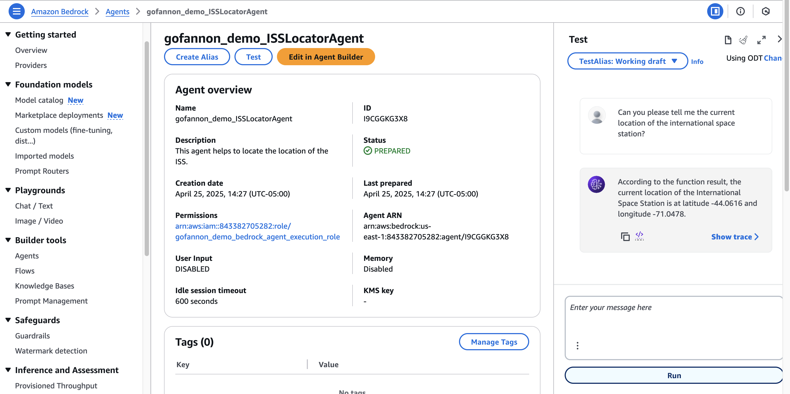

# AWS Bedrock

[Bedrock](https://aws.amazon.com/bedrock/) is Amazon Web Service's (AWS) generative AI application platform. It has an agent framework that can be used to deploy Gofannon developed tools.

## Example - ISS Tracker

Gofannon has an [existing tool](https://github.com/The-AI-Alliance/gofannon/blob/main/docs/open_notify_space/open_notify_space.md) to interface with [Open Notify Space](http://open-notify.org/Open-Notify-API/ISS-Location-Now/), a service that provides an API that returns the current latitude and longitude of the International Space Station (ISS).

This can be deployed on AWS Bedrock following the example in `./tests/integration/test_boto3.py`. This code uses the AWS boto3 frameowrk to deploy (and tear down) an agent wrapping the function, allowing the user to interact with a LLM querying it for the real time location of the ISS. This can be further refinded for a pratical use case of sending an alert if the ISS is about to pass within viewing distance. 

## Reference Implementation

The full implementation, along with its workflow, once deployed:



The Gofannon tool is wrapped in an AWS Lambda, attached to a newly created agent, which is then registered and accessible seamlessly from an LLM. This is all done with the Gofannon Bedrock framework. 

In order to get the above to work together properly, the following AWS IAM permissions are also deployed:



### Deployment Prerequisites

1. An AWS account, authenticated with an `aws_access_key_id` and `aws_secret_access_key`, and the account has access to the default project Bedrock LLM `anthropic.claude-3-sonnet-20240229-v1:0`. You can verify you have access to this model using [this link](https://us-east-1.console.aws.amazon.com/bedrock/home?region=us-east-1#/modelaccess). If you don't have access to this model, you can request access to it using the same link.

2. This project, with the project dependencies loaded, and optional dependency `aws`:
    `poetry install --extras aws`

3. In `~/tests/integration` execute `python test_boto3.py`. This will deploy the implementation. Note the output here, you will need it tear the stack down in step #6:

    ```
    {
    "lambdaARN": "arn:aws:lambda:us-east-1:<AWS Account Id>:function:gofannon_demo_iss_locator",
    "lambdaRoleName": "gofannon_demo_bedrock_lambda_execution_role",
    "agentId": "I9CGGKG3X8",
    "agentRoleName": "gofannon_demo_bedrock_agent_execution_role",
    "agentPolicyARN": "arn:aws:iam::<AWS Account Id>:policy/gofannon_demo_bedrock_agent_allow_model",
    "agentActionGroup": "FBWX2MIEZJ"
    }
    ```


4. Using the AWS user interface, access Bedrock -> Agents. You should see an agent named `gofannon_demo_ISSLocatorAgent`:



5. On the agent screen, there is a chat interface you can use to test the agent:



6. Finally, tear down the stack, removing all deployed components. Modify `python test_boto3.py` replacing `buid = True` with `build = False` and replace the `bedrock_config` dict with the values that were output in step #3.

7. Use the AWS user interface to verify the agent and all IAM roles were deleted successfully.